#**Autonomous Car Steering by Behaviro Cloning of Neural Network**


Table of Contents
=================

   * [<strong>Autonomous Car Steering by Behaviro Cloning of Neural Network</strong>](#autonomous-car-steering-by-behaviro-cloning-of-neural-network)
      * [Introduction](#introduction)
      * [Files Submitted and Software Modules](#files-submitted-and-software-modules)
      * [Human Steering Samples](#human-steering-samples)
         * [The utility of left/right camaras' images](#the-utility-of-leftright-camaras-images)
      * [Augmentation and Pre-processing](#augmentation-and-pre-processing)
         * [Steering angle distribution and adjustment](#steering-angle-distribution-and-adjustment)
         * [Samples preparation for training and validation with filtering by small steering angles](#samples-preparation-for-training-and-validation-with-filtering-by-small-steering-angles)
         * [Further augmentation and pre-processing](#further-augmentation-and-pre-processing)
            * [Emulate recovery from off-center examples](#emulate-recovery-from-off-center-examples)
            * [Shadow emulation](#shadow-emulation)
            * [Geometry transformation and normalization of color intensity](#geometry-transformation-and-normalization-of-color-intensity)
            * [Flipping image and negate steering](#flipping-image-and-negate-steering)
            * [Not all data are equally helpful!](#not-all-data-are-equally-helpful)
            * [Effects of processing](#effects-of-processing)
            * [Sample generator](#sample-generator)
      * [Network Architecture for Steering Angle Predictions](#network-architecture-for-steering-angle-predictions)
      * [Training](#training)
         * [Alternative Experiment: Keep 99\x of the Samples with Near Zero Steering](#alternative-experiment-keep-99-of-the-samples-with-near-zero-steering)
         * [Prediction Performance Understanding](#prediction-performance-understanding)
      * [Simulated Steering Performance](#simulated-steering-performance)
      * [Major Factors to Reasonable Steering Performance](#major-factors-to-reasonable-steering-performance)
      * [Concluding Remarks and Further Research](#concluding-remarks-and-further-research)

Created by [gh-md-toc](https://github.com/ekalinin/github-markdown-toc)

## Introduction

The goals / steps of this project are the following:
* Use the simulator to collect data of good driving behavior
* Build, a convolution neural network in Keras that predicts steering angles from images
* Train and validate the model with a training and validation set
* Test that the model successfully drives around track one without leaving the road
* Summarize the results with a written report

This project studys how to use deep neural network and convolutional neural network to clone human steering behavior. 
Human steering behavior is recorded in terms of sequence of photo captures of the road sceen, and recording of the corresponding steering angles applied by the human driver. 
A convolutional and deep neural network is trained with such collected samples to emulate the desired steering angles. 
The autonomus car steering is achieved by feeding live photo captures to trained neural network, and use the neural network to prodict the steering angles. 
In a game simulator, the steering angles are fed to the simulated car to actuate the movement of the car in the simulator. 

The convolutional and deep neural network is implemented with Keras. 

I used the samples of human driving records collected by Udacity through the simulator. No manual samples were used, due to limited amount of time, and my focus on understanding existing problems. 

The project finds that it's feasible to use trained neural network to autonomously steer the car in the simulator.

It turned out that it's most crucial to properly crop front view images and augment sample data to train the neural network to generalize well, and to have well behaved autonomous steering. 

In the project, I also proposed a way to visualize the predictions of steering angles, 
to address the challenges that the neural network training objective function, the loss function, not able to reflect fully the performance of training.

This is a journey of understanding. The project explores the problem space, discover more questions than solutions found.

## Files Submitted and Software Modules

- [train.py](./train.py): the main program to perform training pipeline, it uses model.py to get model definition, or from model.h5 file stored. 
It uses data.py to get generator for samples, and conduct the training with validation of the neural netwok. 
(The project requirement expects the code of train.py to be part of model.py. I decide to split them to be more modular.)

- [model.py](./model.py): defines of the model in Keras

- [data.py](./data.py): provides data collection, augmentation, pre-processing, and sample generator.

- [drive.py](./drive.py): receives image and other car signals from car, feeds to the trained neural network to predict steering angle, and throttle, 
then feeds the steering angle, and throttle to car to driev. (This is provided by Udacity, with some adaptation.)

- [model.h5](./model.h5) containing the trained convolution neural network

- [writeup_report.md](./writeup_report.md) summarize the results of the project. (This file)
- [analyze.py](./analyze.py) some visualization routines to understand the samples, and training performance. 

All the relevant Python source code segments are explained in this document in the proper sections. 

## Human Steering Samples

The sample data is provided by Udacity, to facilitate the training. 

The samples consists of records. Each record has the following fields, illustrated by one sample:

    {'brake': ' 0',
     'center': 'IMG/center_2016_12_01_13_30_48_287.jpg',
     'dir': './data_from_udacity/',
     'left': ' IMG/left_2016_12_01_13_30_48_287.jpg',
     'right': ' IMG/right_2016_12_01_13_30_48_287.jpg',
     'speed': ' 22.14829',
     'steering': ' 0',
     'throttle': ' 0'}

'brake', 'speed', 'steering', 'throttle' recordings of driving signals at the time of capture. 

Note, for steering angle, the postive quantiy would drive the car to the right, and negative to the left, 
where the 'left' and 'right' are defined from the perspective of the human driver behind the hood of the driven car. 

'center', 'left', and 'right' are the pathes to the photo captured, from the center camera, the left, and right camera, respectively. 

### The utility of left/right camaras' images

The centra camera's photo would be closed to what the driver sees when driving (driver's front view). 

The left and right cameras' photos would be the views from slightly left/right sides of the dirver seat. 
Based on the topology of the left/right cameras, they would be similiar to the driver's front view when the car veer to the left/right, 
thus the driver would need to turn the car towards right/left to bring the car back to the center of the lane of the road. 

The above understanding is the base for the augmentation of driving samples to teach the car how recover from off-center of the line. 

Here are the samples of the left, center (front), and right of the driver:

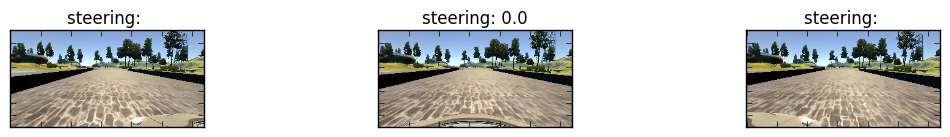

Here is a sample with steering angles near zero:

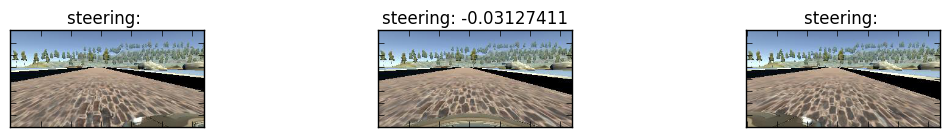

Here is some other with significant steering:

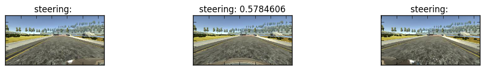

## Augmentation and Pre-processing

### Steering angle distribution and adjustment

In the process of experiment, and participation in the Udacity's Self-Driving-Car Nandgeree (SDC-ND) forum, 
we discovered that to have well behaved trained neural network, there should not be excessive amount of 
samples of 
near zero steering. Otherwise, the neural network will be trained to predict near zero steering most of the time, which would not good enough to drive the car to pass curve roads. 

It turned out that the original data have 
severe imbalance of the distribution of the steering angles. 

Below is the distribution of the steering angles in the data set:


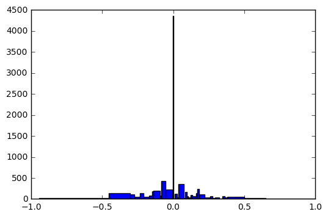

Through numerous experiments, I found out that it worked well only to keep 10% of the samples 
with steering angles in absolute value less than 0.03. The selection of those samples is in random fashion. 

Here is the steering distribution after the adjustment:

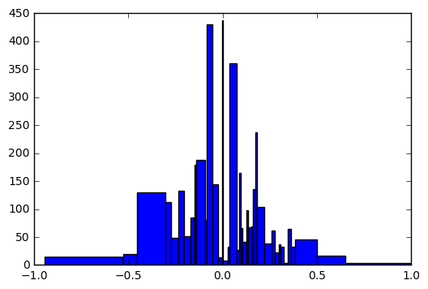

After the adjustment, there only 3836 samples left, from the original 8036.

Here is the code segment for filtering samples by steering angles in [data.py](./data.py)

```
def balance_records(records, threshold, percentage_keep):
    """
    Given the records keep records with steering angle smaller
    than the threshold with some percentage.
    """
    new_records = []
    dropped_records = []
    for r in records:
        if abs(float(r['steering'])) < threshold:
            if percentage_keep < random.uniform(0, 1):  # simulate the probability to drop the record
                dropped_records.append(r)
                continue
        new_records.append(r)
    return new_records, dropped_records
```

For the records with steering angle in absolute value smaller than the threshold, only keep certain percentage randomly. The others are put in a different list, dropped_records. 


### Samples preparation for training and validation with filtering by small steering angles

I decided to explore to only use data from Udacity without additional recovery from off-track samples. 
This is permitted by SDC Bahavior Cloning project requirements. 

The adjusted samples are split into sets of traiing and validation. 90% for training, and 10% for validation. 

Here is the logic for the split of the training and validation samples. 

```
def shuffle_balance_split(data_sources, split=10, steering_threshold=0.03, 
                          steering_keep_percentage=0.1, sequential=False):
    """
    Prepare sample records and split them into training and validation set,
    (One split-th would be used as validation, the rest would be training)
    with filtering, and random shuffling, if required. 
    """
    records, dropped = balance_records(record_list(data_sources),
                                       steering_threshold, steering_keep_percentage)
    if not sequential:
        records = random.sample(records, len(records)) 
    train_list = [records[i] for i in range(len(records)) if (i % split) != 0]
    validation_list = [records[i] for i in range(len(records)) if (i % split) == 0]
    return train_list, validation_list, dropped

```

As I found out that the nature of this steering training problem is very hard to validate. 
The only reliable means to validate is to run with simulator on the tracks. Thus I decided to only use 
10% of the samples for validation, smaller amount than usual. 

Based on experiments, I found it worked well to only keep 10% of the samples with steering angles in absolute values less than 0.03. 

I still keep the option not to do random shuffling, as I need in the subsequent investigation, to have the samples in the original temporal sequence. 

### Further augmentation and pre-processing

The adjusted samples for training are further augmented and processed by the following procedures:

- Use left/right photo with augmented steering angles
- Crop and shrink the photos
- Randomly shift up and down
- The color intensity value of the photo normalized to [0, 1]
- Some random shadow application
- Flip half of the photos

All these augmentation are designed to increase the diversity to help the neural network can generalize better to different road conditinos. 

All the data acqusition, processing (balance adjustment, and pre-processing) can be found in [data.py](./data.py)

#### Emulate recovery from off-center examples

For each sample, the images of left, centre, right is randomly selected. The steering angle is adjusted accordingly by +0.25 or -0.25 for left or right side respectively. 
This hopefully can emulate the examples of steering to the right/left when the car is off-center towards the left/right, respectively. 

Due to there is lack of detailed geometry information of the position of the left/right cameras, especially its orientation and position relative to the driver's position, thus it's hard to be 
accurate to estimate the steering angles to compensate the degree of being off center. 

Below is the relevant code for steering recovery:

```
def image_and_steering(record, augment):
    """
    Returns image, and associated steering angle,
    by randomly selecting from left, center, and right camera,
    compensate the steering angle, if needed.
    """
    cameras = ['left', 'center', 'right']
    cameras_steering_correction = [.25, 0., -.25]
    # Randomly select camera
    camera_idx = np.random.randint(len(cameras)) if augment else 1
    camera = cameras[camera_idx]
    # Read image and work out steering angle
    image = mpimg.imread(os.path.join(record['dir'],
                                      record[camera].strip()))
    # mping.imread reads image in RGB channel order consistent with that used in drive.py
    # Image.open(BytesIO(base64.b64decode(imgString)))
    angle = float(record['steering']) + cameras_steering_correction[camera_idx]
    return image, angle

```

#### Shadow emulation

The applications of some random shadows is to increaste the diversity of the lighting conditions of the driving scenes. 

```
def shadow(image):
    # Add random shadow as a vertical slice of image
    h, w = image.shape[0], image.shape[1]
    [x1, x2] = np.random.choice(w, 2, replace=False)  # determine two random position on horizontal
    k = h / (x2 - x1)
    b = - k * x1
    for i in range(h):
        c = int((i - b) / k)
        image[i, :c, :] = (image[i, :c, :] * .5).astype(np.int32)
    return image

```

#### Geometry transformation and normalization of color intensity

The cropping is to remove the cluters in the view areas above the road (the surroundings, trees, and sky, etc.), and also the near field view of the car's hook, etc. 
This turned out to be the most crucial to enable the training to generalize. Perhaps, with the clutters removed, 
the examples are much more universal in terms of the relationship between the geometry pattern of road surface, and the steering angles. 
In fact, even the extent of cropping the top portion of the photo matters whether the training can be successful or not. 
I experimented with different cropping percentage of the top portion, and found that only 0.375 would work well, 
values less than that would cause the steering less consistent, and more shaking. 

The photo size from (160, 320) is shrinked to (32, 128). The shrinking of the photo may help to reduce the computation, 
and also serve as smooth average operations to make the details as less prominent. 
By observing the photo samples, it seems that the crucial factors to proper steering is to recognize the geometry  shapes of road area and associate the desired steering angles, 
while the other details might just be distractions. 

The color intensity normalization would help the neural network to learn free from dominance of extreme values in the input. 

Below is the code for the geometry transformation and normalization:
```
def preprocess(image, top_offset=.375, bottom_offset=.125): # experimented with top_offset, 0.25, 0.3, no good. 
    """
    Crops an image by `top_offset` and `bottom_offset` portions of image, 
    resizes to 32x128 px and scales pixel values to [0, 1].
    """
    top = int(top_offset * image.shape[0])
    bottom = int(bottom_offset * image.shape[0])
    image = sktransform.resize(image[top:-bottom, :], (new_row, new_col, 3))
    return image
```

The same processing of the input image is applied to [drive.py](./drive.py), which receives live feeds of center camera photos and produce prediction of steering angles. 
This is necessary as I must feed to the neural network the data with the same scheme of processing, format, and size. Many pitfalls happened of missing the consistency.

The random shift up and down by about 5% of the height of the photo is to simulate the car's positions in uphill, or downhill, respectively. 
This is implemented by making the top_offset, and bottom_offset random variables off the constants of 0.375, and 0.125 respectively.

```
# Randomly shift up and down while pre-processing
                v_delta = .05 if augment else 0
                image = preprocess(
                    image,
                    top_offset=random.uniform(.375 - v_delta, .375 + v_delta),
                    bottom_offset=random.uniform(.125 - v_delta, .125 + v_delta)
                )

```
#### Flipping image and negate steering

In order to enrich sample varieties helpful for training generalization, 
some samples are randomly picked to be flipped, and steering angles negated. This is to emulate the cases of symmetry scenes of the front view. 

Here is the relevant code segment:

```
# Randomly flip half of images in the batch
                flip_indices = random.sample(range(x.shape[0]), int(x.shape[0] / 2))
                x[flip_indices] = x[flip_indices, :, ::-1, :]
                y[flip_indices] = -y[flip_indices]

```

It randomly select half of the samples to be flipped. 


#### Not all data are equally helpful!

I had hard time to give up the samples with near zero steering angles. 
After all, they are "precious" to collect, and may contain helpful training information. 
I had explored to use those samples' left/right images for simulated right/left turn steering. 
But in my experiemnts, it turned out to be not helpful. 
I guess that the such simulated samples, although no longer have near zero steering, 
but they would have symetry +0.25 or -0.25 steering angles. 
Besides they are account for more than 50% of the original samples ensembles. 
Such symetry with the dominanent proportion would cancel out each other, would still force the network to produce near zero predictions most of the time. 

It's a great lesson, not all "BIG data" are equally good. One need to judiciously understand the implication of such data's impact to neural network's trained behavior. 

#### Effects of processing

Here is the steering angle distribution after the processing for the training set:

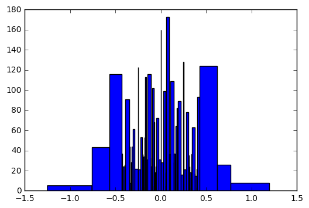

Here are some samples of after processing:

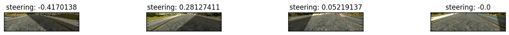

For validation set, no augmentation is performed.

#### Sample generator

The samples are provided as Python generators to save memory footprint. 
Here is the generator code:

```
def gen_samples(records, batch_size=128, augment=True, sequential=False):
    """
    Keras generator yielding batches of training/validation records.
    Applies records augmentation pipeline if `augment` is True.
    """
    #print('enter gen_samples:')
    while True:
        # Generate random batch of indices
        indices = range(len(records)) if sequential else np.random.permutation(len(records))

        for batch in range(0, len(indices), batch_size):
            batch_indices = indices[batch:(batch + batch_size)]
            # Output arrays
            x = np.empty([0, new_row, new_col, 3], dtype=np.float32)
            y = np.empty([0], dtype=np.float32)
            # Read in and preprocess a batch of images
            for i in batch_indices:
                image, angle = image_and_steering(records[i], augment)
                if augment:
                    image = shadow(image)
                # Randomly shift up and down while pre-processing
                v_delta = .05 if augment else 0
                image = preprocess(
                    image,
                    top_offset=random.uniform(.375 - v_delta, .375 + v_delta),
                    bottom_offset=random.uniform(.125 - v_delta, .125 + v_delta)
                )
                # Append to batch
                x = np.append(x, [image], axis=0)
                y = np.append(y, [angle])
            if not sequential:
                # Randomly flip half of images in the batch
                flip_indices = random.sample(range(x.shape[0]), int(x.shape[0] / 2))
                x[flip_indices] = x[flip_indices, :, ::-1, :]
                y[flip_indices] = -y[flip_indices]
            yield (x, y)

```
## Network Architecture for Steering Angle Predictions

I first started with following comma.ai's example, as it has the most appropriate code example for the same problem of steering prediction. 

I split samples into training, and validation. I used the training samples to train the network model, and use the validation to validate if the network is properly trained. 

Initially, I set up the network model, and use random weights to verify if the setup is reasonable. 
I used the model with random weights to drive the simulated car. At the beginning, the car wouldn't move. 
It helped me to realize that I had a bug in the code of reading the image, the read image has different color channel sequence, of BGR, instead of the RGB order provided by the program drive.py.

I also used only three samples deliberately to train the network model to make sure that it's possible to overfit the network model to prove 
that the network is capable to learn such limited numbers of examples. 
I then gradually increased the number of samples, to my disappointment, the network can no longer fit perfectly with the slightly increased number of samples. 
The loss errors for the training samples would settle at a plateau, or fluctuate at roughly the same range.
Also the loss curve for validation samples would even be lower, and more smooth. 

I found that the car would drive to the road side soon after started. 
After much investigation, I found that my pre-processing code and the code added to drive.py had serious logic error. 
Which caused the predictions feed to the simulated car first of the opposite sign, and then is only the 100th of the network's predictions. 
The phenomena is that the car would stay on the right side of the road, when the road turned left, it would went almost straight off the road. 

After fixing the bugs, then with less than perfect loss curves, I was able to steer the simulated car to complete the full tracks.  
I eventually reduced the network into the following final form, while still achieved the same driving performance. 

```
# new image dimension
new_row, new_col = 32, 128

def steering_model(optimizer = optimizers.Adam(lr=1e-04), loss='mse', metrics = ['accuracy']):
    """
    returns a Keras network model
    """
    model = Sequential()
    model.add(convolutional.Convolution2D(16, 3, 3, input_shape=(new_row, new_col, 3), activation='relu'))
    model.add(pooling.MaxPooling2D(pool_size=(2, 2)))
    model.add(convolutional.Convolution2D(32, 3, 3, activation='relu'))
    model.add(pooling.MaxPooling2D(pool_size=(2, 2)))
    model.add(convolutional.Convolution2D(64, 3, 3, activation='relu'))
    model.add(pooling.MaxPooling2D(pool_size=(2, 2)))
    model.add(core.Flatten())
    model.add(core.Dense(300, activation='relu'))
    model.add(core.Dropout(.5))
    model.add(core.Dense(100, activation='relu'))
    model.add(core.Dropout(.25))
    model.add(core.Dense(20, activation='relu'))
    model.add(core.Dense(1))
 
    model.compile(optimizer = optimizer, loss = loss, metrics = metrics)
    return model
```

The network has 3 groups of convolution and max pooling layers. The convolution layers are considered to extract the geometry features with increasing sophistication. 
The max pooling might perform some kind of abstraction leaving out less relevant details. 

After those, there layers of fully connected "deep" neural networks. The number of hidden units are empirical. I feel that the number of them might still be reduced. 
Significant dropout were used to encourage generalization, and over-fitting. 

The relu activation is used to further encourage non-linearity.

The optimizer is Adam with decreasing learning rate, starting from 0.0001. I experiment with the other Keras's optimizers, such as SGD, etc., and settled with Adam, 
as it produces the most consistent steering performance.

I used "mean squared error" as loss function. 

I had experimented other loss functions, but none found to be better than 'mse', so far, given the limited amount of time.

I had recollection that the 'mse' mathematically would result in the neural network through gradient decent to approximate to the average of the distribution of the target function population values. 
I had explored to devise a loss function that would ascent more the singlarity in the function approximation. 
Due to time limitation, the research will be done when there is more time. 
For car steering, the desirable approximation would be that there is no significant deviation from targets, while it's Ok to have minor deviations. 

The model might be further reduced with the understanding that it's not possible, even expected to have "perfect" predictions.

Based on experiments, it turned that the problem of steering angle prediction has unique charateristics. 

On the one hand it's a hard problem to train neural network to be perfect, even for the trained samples. 

On the other hand, car steering does not need to have exact steering angle most of the time. Even human driver may have 
wide range of steering angles. What is important is that the prediction to be stable, consistent in prediction pattern.

With the characteristics, it turned out that with properly processed training samples, quite many kinds of network architecture would produce good enough predictions. 

The code for model can be found at [model.py](./model.py)

## Training

Note: **The training conduit progarm is in [train.py](train.py). In the project requirement, it is expected to be in model.py.** 
I split the training conduit from model.py in order to be more modular. 

Even with pre-processing and augmentation, and model exploration, 
The training is frustrating bout afterwards straightforward. 
Frustrating is that the loss curve of number of epochs will stop decreasing very early on, reaching plateau. 

It's straight fowrad that the driving performance cannot be told by the loss function value, and its trajactory. One has to experiment on the tracks. 

On the countrary to the common believe that the network and training tends to be over-fitting. 
I believe that my situation shows singn of under-fitting, beacuse the loss for training does not decrease much after long training, 
and the training loss is worse, and more fluctuating than the validation. 

With the under-fitting problems, I have not found a good network structure, hyper-parameters, and training epochs to reduce the loss further. 

However, it seems to this particular problem, it does not matter, due to the large margin of tolerance in the steering angles. 

Here are the loss curve of trainings with samples filterd out 90% of the near zeor steering samples, and augmented. 

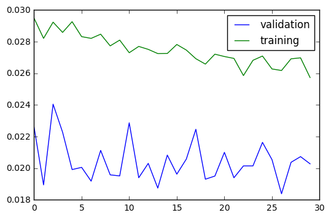

Note, as the validation has only 383, 10% of the total valid samples, without augmentation, 
thus the sample diversity may not be as large, thus the performance is even better than that of the training. 

All the hyper parameters were determined through experiments and discussion on the forum. 

The number of training epochs have also been experimented extensively. 
I did a trial of 1200 epochs overnight, and watching for the reduction of validation loss, 
and found that after epoch 29, there is no further reduction. Also upon driving test, 
the weights at the epoch 29 performed better than that after epoch 1200, 
the steering is more steady, less zig-zag swing. 

The driving performance will be shown as video capture in following sections and in the repository of the project. 

Here is the code to perform the training:

```
def train(model, data_sources, batch_size=64, epochs=29, verbose=0,
          split=10, steering_keep_percentage=0.1):
    """
    train with model, data source, and exiting weights, if existing.

    Returns the training history, and the trained model
    """
    train_list, validation_list, dropped = shuffle_balance_split(
        data_sources, split=split,
        steering_keep_percentage=steering_keep_percentage)
    # use 10 percent of the data for validation
    # will review if I should use those dropped samples of small steering angles.
    # Thay may be good for pure augmentation on the left, and right cameras emulation.

    from keras.callbacks import ModelCheckpoint, ReduceLROnPlateau
    history = model.fit_generator(gen_samples(train_list, batch_size=batch_size, augment=True),
                                  samples_per_epoch=len(train_list),
                                  nb_epoch=epochs, verbose=verbose,
                                  validation_data=gen_samples(
                                      validation_list, batch_size=batch_size, augment=False),
                                  nb_val_samples=len(validation_list),
                                  callbacks=[
                                      ModelCheckpoint(
                                          filepath="./model-current/model-{epoch:02d}-{val_loss:.2f}.h5",
                                          verbose=1, save_best_only=True, period=30)])
    print('Training ends...')
    return history, model


```
### Alternative Experiment: Keep 99% of the Samples with Near Zero Steering

I also did an experiment of keeping 99% of the samples with near-zero steerings. 
It tuned out that the actual driving performance is comparable to the one with the filtering. The training curve of the experiment is below. 

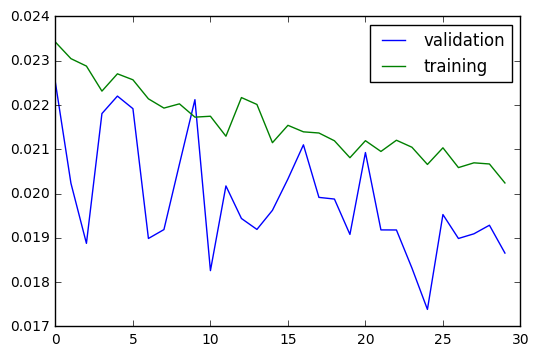

### Prediction Performance Understanding

Below is the prediction performance after 1200 epchos, as an example. 

How to read the chart?

The target values of steering angles from the samples are ploted as horizontal bar as purple color with hatch symbol '|'. 
The predictions are ploted likewise in two colors. 
For the predictions, between which and the corresponding targets, the absolute value of the difference is less than 0.1 (OK prediction), i
the predictions are ploted as yellow color, after overlapping with the target color, it becomes greenish. 
For the other predictions (Bad predicti), they are plotted as black (grey color), 
after overlapping it becomes dark purple. So the more overlapping, the better prediction.

The samples are re-arranged back into the original sequential order when collected, 
hoping to reflect the temporal/sequential patterns of the samples. 
Also note, the training samples does not include augmentation, in their original form 
(this to remove the distortion of some random flipping of the image, thus with opposite steering angles, 
since it is not part of the natural steering pattern.)

One can see that the predictions even for the training samples is far from perfect. 
Most worry-some is that the there are some predictions that are the opposite of the target. 
This might be a safety concerns!

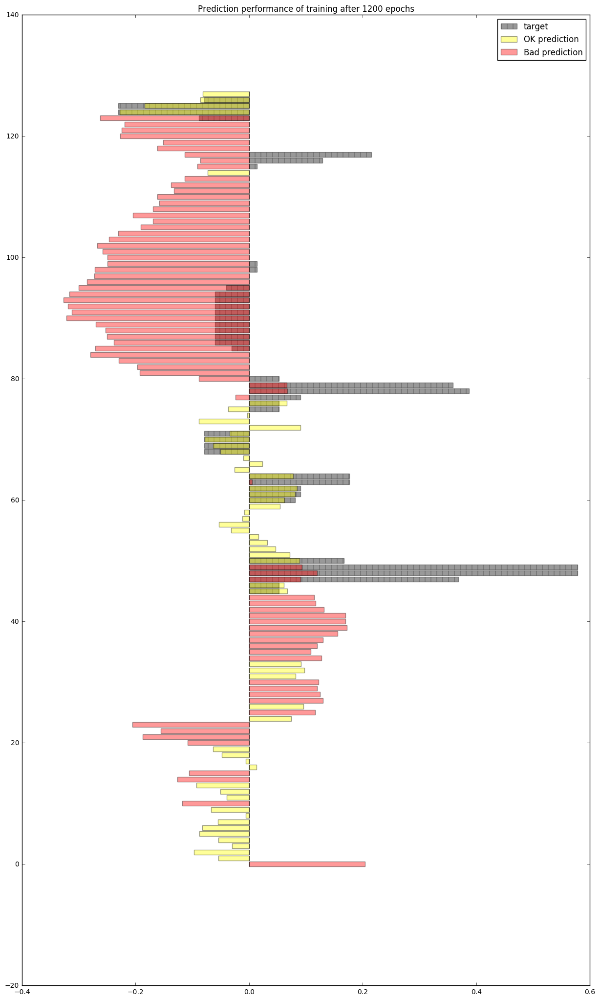

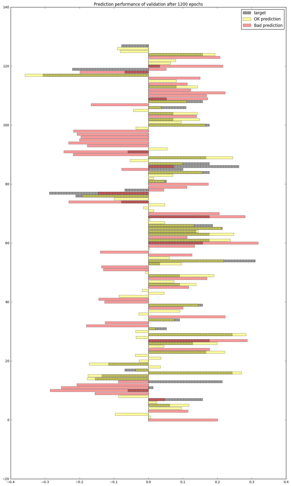

Overall, the trained network provides a lot more steering than the human examples. 
The provided steerings are often in larger magnitude than the corresponding target values, even sometimes, opposite steering! 
It remains a mystery that the above chart shows very poor predictions. 
Unless there is some bugs in my display routine, I wonder why the simulated steering looked OK although it did exhibit with some zig-zag swing movement. 

Here is the routine to plot the predictions compared with the targets:

```
# Show the predictions compared with the targets
def show_predictions(model, generator, number_to_show=None, label='training', threshold=0.1):
    x, y = next(generator)
    number_to_show = min(y.shape[0], number_to_show or y.shape[0])
    predictions = model.predict_on_batch(x)
    predictions = predictions[:, 0]

    delta = predictions - y

    ok_predictions = np.zeros(number_to_show)
    bad_predictions = np.zeros(number_to_show)
    
    ok_indices = abs(delta) < threshold
    ok_predictions[ok_indices] = predictions[ok_indices]

    bad_indices = threshold <= abs(delta)
    bad_predictions[bad_indices] = predictions[bad_indices]

    print('The maximum in magnitude of the delta: ', max(abs(delta)))
    bar_width = 0.2
    plt.figure(figsize=(15, number_to_show*bar_width))
    signal_seq = range(number_to_show)
    plt.barh(signal_seq, y[:number_to_show], align='center', alpha=0.4, label='target', color='black', hatch='|', edgecolor = 'black')
    plt.barh(signal_seq, ok_predictions, align='center', alpha=0.4, label='OK prediction', color='yellow')
    plt.barh(signal_seq, bad_predictions, align='center', alpha=0.4, label='Bad prediction', color='red')
    plt.legend(loc='best')
    plt.title('Prediction performance of ' + label)
    return model

```
## Simulated Steering Performance

Using the Udacity provided simulator and my drive.py file, the car can be driven autonomously around the track by executing
```python drive.py model.h5```

Some adjustment to throttle value in [drive.py](./drive.py) is made, which is provided by Udacity. 
I made the throttle to be larger when the speed is too low. 
This is needed for track 2, when the car is driving uphill, with the constant throttle, 0.2, 
the car would not be able to move at the certain section of the steep hill road. 

Also drive.py has been added the image pre-processing employed by neural network training to be consistent with the training scheme. 

Below are the relevant code segment:

```
from data import preprocess

@sio.on('telemetry')
def telemetry(sid, data):
    if data:
        # The current steering angle of the car
        steering_angle = data["steering_angle"]
        # The current throttle of the car
        throttle = data["throttle"]
        # The current speed of the car
        speed = data["speed"]
        # The current image from the center camera of the car
        imgString = data["image"]
        image = Image.open(BytesIO(base64.b64decode(imgString)))
        image_array = np.asarray(image)
        image_array = preprocess(image_array) # cropping and normalize
        steering_angle = float(model.predict(image_array[None, :, :, :], batch_size=1))
        throttle = 0.2 if 5 < float(speed) else 1.0  # boost throttle in uphill
        print(steering_angle, throttle)
        send_control(steering_angle, throttle)


```
The setup and trained neural network was able to drive the car over track 1, and track 2.

It's amazing that this is achieved with rather small amount of training samples, 3465, without any manual collection of off-track recovering examples!

Here are some clips of the driving experiments. 

Note, without the filtering out the samples with near-zero steering, the trained network also performs OK, 
but with a little bit more swing at some sections. 
I feel that more samples might eventually proved to be helpful to generalize, thus I decice to keep it as part of the experiment. 

The steering performance on the track with training samples:


The steering performance on the track never seen by the neural network before:


## Major Factors to Reasonable Steering Performance

Although, I have invested majority amount of time to explore proper network architecture, the hyper-parameters, trying
to minimize the error loss value. 
From hind-sight, it seems to me the surprizing factors that actually helped tremendously for the relative good performance of the neural networks are as follow:

- Generous cropping of the photo only keeps the most relevent portion for steering. This might helped the most to genearlize. (I suspect that the other adding random noise is not as helpful.)
- Courageously getting rid of samples of near zero steering angles might help when the sample size is not enough to support generalizaiton, with varietys of scens. 

However, I experimented with the top_offset percentage for cutting the sky and distant view, 
and found that decreasing the value from 0.375 to 0.3, or 0.25, would not work at all. 
The predictions would be much vary, and eventually causing car to ditch into road side. 
This is scary, that this type of learning is not yet stable, or not well understood yet. 

I'm in debt to fellow students' help, specially, 
to [Alex Staravoitau](http://navoshta.com/end-to-end-deep-learning/), 
I eventually adapted his pre-processing scheme, and his network structure with some further optimization 
after my own explorations. I also demonstrated that getting rid of samples with near-zero steering may not be necessary

## Concluding Remarks and Further Research

The steering prediction problem is form of regression problems. It has unique charateristics of requiring consistent, but with margin of tolerance of inaccuracy. 
The current regim of neural network training works but not quite straightforward in evaluating the actual performance of the training. 
The cross-validaiton, and learning curve are not as effective compared to their application to image categorizations. 

The detailed examinations of the predictions compared to the target steering shows alarming inaccuracy. I feel this type diagram is a good starting point to understand the 
steering behavior, and may offer opportunity to understand the steering performance, and its improvement.

Although, the simulated autonomous steering seemingl work in the simulator, 
there should be some more research to exploit the charateristics of the problem. For example, 

- More suitable loss function to reflect the desired characteristics. 
- Although, the neural network "survived" these two tracks, I doubt that it can really generalize consistently. 
There should be more research on how to use neural network with assurance of reliable predictions. 
- To be practical, more research would be needed to reduce the cost of computation, at least, the cost of prediction, if not feasible for training, 
so that it would be feasible to apply to real autonomous steering in car. 
- Maybe, the edge detection algorithm, such as Canny edge detector might help to reduce the amount of data fed to the neural network and would still provide sufficient relevant information for learning? It would save some computation cost.
- Some kind of post-processing to morph the predictions in series to be more sensible, and overcoming excessive inaccuracies.
- The realtime steering angle should be adaptive to the speed of the car at the moment. Observing the samples of human driving, the steering angles are not continuous, 
as they are dependent to the speed, and throttle applied at the time of steering. 
Therefore, it's not a purely a relationship from geometry pattern to steering angle. 
The model would be a function from the front view scene, the speed, and the throttle to next steering angle, the next throttle.
- More research is needed to validate the approach of focusing on the road surface area for autonomous steering. For example, one might devise one learning system to learn the relevant road surface areas, such as lane detection, then use another system to predict the steering angle. 
- Maybe, an alternative network architecture to have more constraints on the output of the neural network so that it's less likely to produce opposite steering predictions, such as using multiple output nodes to vote for steering control.
- More visualization tools need to be developed to help to understand the problems and effectiveness of the solution. 
